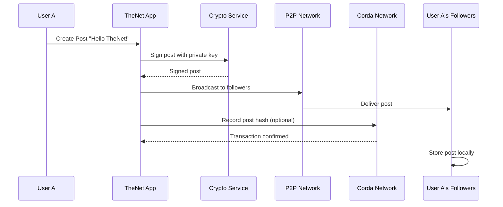
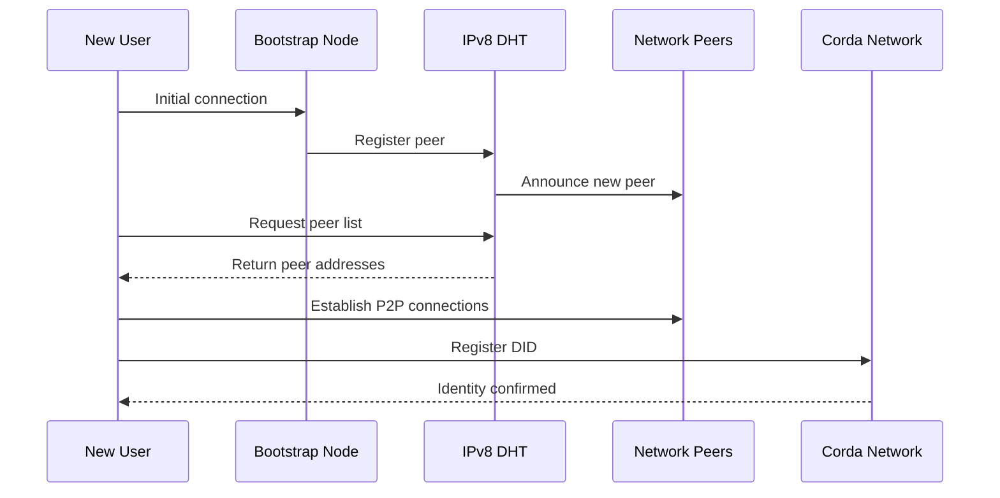

# TheNet System Architecture Overview

Comprehensive overview of TheNet's decentralized social platform architecture, covering all major components and their interactions.

## 🎯 System Goals

### Primary Objectives
- **Full Decentralization**: No central servers or single points of failure
- **User Data Ownership**: Users control their data through cryptographic keys and P2P distribution
- **Censorship Resistance**: Content remains available as long as any peer hosts it
- **Privacy-First Design**: Zero-knowledge identity verification and selective data sharing
- **Trust Through Transparency**: All system actions cryptographically verifiable

### Design Principles
- **Security by Design**: All interactions cryptographically secured
- **Gradual Consistency**: Accept eventual consistency for better availability
- **Mobile-First**: Optimized for intermittent connectivity and battery efficiency
- **Scalable Federation**: Support for independent communities with optional interconnection

## 🏗️ High-Level Architecture

```
┌─────────────────────────────────────────────────────────────────┐
│                        User Interface Layer                     │
│  ┌─────────────┐  ┌─────────────┐  ┌─────────────────────────┐ │
│  │   Android   │  │     iOS     │  │        Desktop          │ │
│  │     App     │  │     App     │  │    (Windows/Mac/Linux)  │ │
│  └─────────────┘  └─────────────┘  └─────────────────────────┘ │
└─────────────────────────────────────────────────────────────────┘
                                │
                                ▼
┌─────────────────────────────────────────────────────────────────┐
│                   Shared Business Logic Layer                   │
│  ┌─────────────┐  ┌─────────────┐  ┌─────────────┐             │
│  │  Identity   │  │  Content    │  │   Social    │             │
│  │ Management  │  │ Management  │  │ Networking  │             │
│  └─────────────┘  └─────────────┘  └─────────────┘             │
└─────────────────────────────────────────────────────────────────┘
                                │
                                ▼
┌─────────────────────────────────────────────────────────────────┐
│                      Service Layer                              │
│  ┌─────────────┐  ┌─────────────┐  ┌─────────────┐             │
│  │ Blockchain  │  │ P2P Network │  │ Crypto      │             │
│  │ (Corda)     │  │ (IPv8)      │  │ Services    │             │
│  └─────────────┘  └─────────────┘  └─────────────┘             │
└─────────────────────────────────────────────────────────────────┘
                                │
                                ▼
┌─────────────────────────────────────────────────────────────────┐
│                      Infrastructure Layer                       │
│  ┌─────────────┐  ┌─────────────┐  ┌─────────────┐             │
│  │ Local       │  │ Content     │  │ Network     │             │
│  │ Storage     │  │ Distribution│  │ Transport   │             │
│  └─────────────┘  └─────────────┘  └─────────────┘             │
└─────────────────────────────────────────────────────────────────┘
```

## 🔧 Core Components

### 1. Identity Management System

#### Decentralized Identity (DID)
- **Technology**: Hyperledger Identus (formerly Atala PRISM)
- **Purpose**: Self-sovereign identity without central authority
- **Features**: 
  - W3C DID-compliant identities
  - Verifiable credentials for user verification
  - Privacy-preserving identity proofs

#### Identity Verification
- **KYC Provider**: zkPass for zero-knowledge identity verification
- **Process**: Users prove identity without revealing personal information
- **Levels**: Anonymous (default) → Verified (after KYC)
- **Benefits**: Verified users can post media, issue invites, higher rate limits

```kotlin
// Identity architecture
interface IdentityService {
    suspend fun createDID(): Result<DID>
    suspend fun verifyIdentity(proof: ZKProof): Result<VerificationCredential>
    suspend fun getIdentityStatus(did: DID): Result<IdentityStatus>
}

data class DID(
    val id: String,              // did:prism:xyz123...
    val publicKey: PublicKey,
    val document: DIDDocument
)

sealed class IdentityStatus {
    object Anonymous : IdentityStatus()
    data class Verified(val credentials: List<VerifiableCredential>) : IdentityStatus()
}
```

### 2. Peer-to-Peer Networking

#### IPv8 Integration
- **Technology**: IPv8 (Python-inspired Kotlin implementation)
- **Purpose**: Decentralized peer discovery and communication
- **Features**:
  - DHT-based peer discovery
  - NAT traversal and hole punching
  - Community-based message routing
  - Anti-spam and Sybil attack resistance

#### Network Topology
```
┌─────────────┐     ┌─────────────┐     ┌─────────────┐
│    User A   │────▶│    User B   │────▶│    User C   │
│  (Android)  │     │  (Desktop)  │     │    (iOS)    │
└─────────────┘     └─────────────┘     └─────────────┘
       │                   │                   │
       ▼                   ▼                   ▼
┌─────────────────────────────────────────────────────┐
│               IPv8 P2P Network                      │
│  - Peer Discovery (DHT)                             │
│  - Message Routing                                  │
│  - NAT Traversal                                    │
│  - Community Management                             │
└─────────────────────────────────────────────────────┘
```

```kotlin
// P2P networking architecture
interface P2PNetworkService {
    suspend fun joinNetwork(community: CommunityId): Result<Unit>
    suspend fun discoverPeers(maxPeers: Int): Result<List<Peer>>
    suspend fun sendMessage(peer: PeerId, message: ByteArray): Result<Unit>
    fun subscribeToMessages(): Flow<P2PMessage>
}

data class P2PMessage(
    val senderId: PeerId,
    val content: ByteArray,
    val signature: Signature,
    val timestamp: Instant
)
```

### 3. Blockchain Layer

#### R3 Corda Integration
- **Technology**: R3 Corda with Kotlin CorDapps
- **Purpose**: Immutable record keeping and consensus
- **Use Cases**:
  - User registration and reputation
  - Invitation system transparency
  - Content governance and moderation
  - Community rule enforcement

#### Smart Contracts (CorDapps)
```kotlin
// User management CorDapp
@BelongsToContract(UserContract::class)
data class UserState(
    val did: DID,
    val verificationStatus: VerificationStatus,
    val invitedBy: DID?,
    val reputation: Int,
    val joinedAt: Instant,
    override val participants: List<AbstractParty>
) : ContractState

// Invitation system CorDapp
@BelongsToContract(InvitationContract::class)
data class InvitationState(
    val id: InvitationId,
    val inviter: DID,
    val inviteeEmail: String,
    val status: InvitationStatus,
    val expiresAt: Instant,
    override val participants: List<AbstractParty>
) : ContractState
```

### 4. Content Management

#### Content Storage Strategy
```
User Device Storage (Primary)
├── Posts by User (encrypted)
├── Following List (encrypted)
├── Cached Content from Followed Users (TTL-based)
└── Pinned Content (permanent)

Peer Network Storage (Secondary)
├── Content Replication (followers cache creator's content)
├── Popular Content Caching (community-driven)
└── Archive Nodes (long-term preservation)

IPFS/BitTorrent Distribution (Tertiary)
├── Media File Distribution (images, videos)
├── Large Content Chunks
└── Permanent Archival Storage
```

#### Content Versioning
- **Technology**: Git-like versioning with Merkle trees
- **Benefits**: Immutable content history, efficient delta storage
- **Implementation**: JGit/KGit with custom content-addressing

```kotlin
// Content architecture
data class Post(
    val id: PostId,
    val content: String,
    val authorDID: DID,
    val signature: Signature,
    val timestamp: Instant,
    val version: Int,
    val previousVersion: PostId?,
    val mediaAttachments: List<MediaReference>
)

interface ContentService {
    suspend fun createPost(content: String, media: List<Media>): Result<Post>
    suspend fun editPost(postId: PostId, newContent: String): Result<Post>
    suspend fun getPost(postId: PostId): Result<Post>
    suspend fun getPostHistory(postId: PostId): Result<List<Post>>
}
```

### 5. Cryptographic Services

#### Security Implementation
```kotlin
interface CryptographyService {
    // Digital signatures
    suspend fun signMessage(message: ByteArray, privateKey: PrivateKey): Result<Signature>
    suspend fun verifySignature(message: ByteArray, signature: Signature, publicKey: PublicKey): Result<Boolean>
    
    // Encryption
    suspend fun encrypt(data: ByteArray, publicKey: PublicKey): Result<EncryptedData>
    suspend fun decrypt(encryptedData: EncryptedData, privateKey: PrivateKey): Result<ByteArray>
    
    // Key management
    suspend fun generateKeyPair(): Result<KeyPair>
    suspend fun storePrivateKey(alias: String, privateKey: PrivateKey): Result<Unit>
    suspend fun getPrivateKey(alias: String): Result<PrivateKey>
}

// Platform-specific secure storage
expect class SecureKeyStorage {
    suspend fun storeKey(alias: String, key: ByteArray): Result<Unit>
    suspend fun getKey(alias: String): Result<ByteArray>
    suspend fun deleteKey(alias: String): Result<Unit>
}
```

## 🔄 Data Flow Architecture

### Message Creation and Distribution


### Peer Discovery and Connection


## 🔒 Security Architecture

### Trust Model
```
┌─────────────────────────────────────────────────────────────┐
│                     Trust Hierarchy                        │
│                                                             │
│  1. Cryptographic Proof (Highest Trust)                    │
│     ├── Digital Signatures                                 │
│     ├── Zero-Knowledge Identity Proofs                     │
│     └── Blockchain Consensus                               │
│                                                             │
│  2. Reputation-Based Trust (Medium Trust)                  │
│     ├── Community Reputation Scores                        │
│     ├── Invitation Chain Verification                      │
│     └── Historical Behavior Analysis                       │
│                                                             │
│  3. Social Trust (Lower Trust)                             │
│     ├── Social Graph Proximity                             │
│     ├── Mutual Connections                                 │
│     └── Community Endorsements                             │
└─────────────────────────────────────────────────────────────┘
```

### Attack Resistance
- **Sybil Attacks**: Prevented by invitation-only system and reputation tracking
- **Eclipse Attacks**: Mitigated by diverse peer selection and DHT redundancy
- **Content Tampering**: Prevented by cryptographic signatures and content hashing
- **Spam/Flooding**: Controlled by rate limiting and reputation-based filtering
- **Privacy Attacks**: Protected by zero-knowledge proofs and selective disclosure

## 📊 Performance Characteristics

### Scalability Targets
```
Network Size: 
├── Phase 1: 1,000 users (MVP)
├── Phase 2: 10,000 users (Beta)
├── Phase 3: 100,000 users (Launch)
└── Phase 4: 1,000,000+ users (Scale)

Performance Metrics:
├── Message Delivery: <5 seconds P2P, <30 seconds global
├── Peer Discovery: <10 seconds for initial connection
├── Blockchain Finality: <1 minute for consensus
├── Content Sync: <60 seconds for follower feeds
└── Mobile Battery: <5% drain per hour active use
```

### Optimization Strategies
- **Content Caching**: Intelligent caching based on social graph proximity
- **Lazy Loading**: Load content on-demand rather than bulk syncing
- **Delta Sync**: Only sync changes rather than full content
- **Compression**: Use efficient content encoding for network transmission
- **Background Sync**: Utilize idle time for non-critical operations

## 🌐 Network Topology

### Community Structure
```
TheNet Global Network
├── Public Communities (Open to all verified users)
│   ├── General Discussion
│   ├── Technology
│   └── Creative Content
├── Private Communities (Invitation-only)
│   ├── Local Communities (geographic)
│   ├── Professional Networks
│   └── Special Interest Groups
└── Federated Networks (Independent TheNet instances)
    ├── Corporate TheNet (internal company social)
    ├── Educational TheNet (university networks)
    └── Regional TheNet (country-specific instances)
```

### Message Routing
- **Direct Messages**: Point-to-point encrypted communication
- **Timeline Posts**: Broadcast to followers with efficient routing
- **Community Posts**: Multicast within community boundaries
- **Global Discovery**: Optional participation in global content discovery

## 🚀 Deployment Architecture

### Node Types
```
┌─────────────────────────────────────────────────────────────┐
│                     Node Deployment                        │
│                                                             │
│  Bootstrap Nodes (Foundation-operated)                     │
│  ├── Initial peer discovery                                │
│  ├── Network health monitoring                             │
│  └── Protocol upgrade coordination                         │
│                                                             │
│  User Nodes (Client applications)                          │
│  ├── Mobile apps (Android/iOS)                             │
│  ├── Desktop applications                                  │
│  └── Web interfaces (future)                               │
│                                                             │
│  Archive Nodes (Community-operated)                        │
│  ├── Long-term content preservation                        │
│  ├── Historical data access                                │
│  └── Network resilience                                    │
│                                                             │
│  Corda Nodes (Blockchain network)                          │
│  ├── Identity management                                   │
│  ├── Consensus and validation                              │
│  └── Smart contract execution                              │
└─────────────────────────────────────────────────────────────┘
```

## 🔮 Future Architecture Evolution

### Planned Enhancements
- **WebAssembly Integration**: Run Kotlin code in web browsers
- **Layer 2 Scaling**: Implement state channels for high-frequency operations
- **AI Content Moderation**: Community-trained models for content filtering
- **Cross-Chain Bridges**: Connect with other blockchain networks
- **Quantum-Resistant Crypto**: Prepare for post-quantum cryptography

### Extension Points
- **Plugin Architecture**: Allow third-party extensions and integrations
- **API Gateway**: RESTful and GraphQL APIs for external integrations
- **Webhook System**: Real-time notifications for external services
- **Custom Communities**: Allow communities to define custom rules and governance

---

This architecture provides the foundation for a truly decentralized, user-centric social platform that scales from individual users to global communities while maintaining privacy, security, and user control.

For implementation details, see the specific component documentation and [Architecture Decision Records](./adr/).

**Next Steps**: Review [ADR documentation](./adr/) and [implementation guides](../setup/) to begin development.